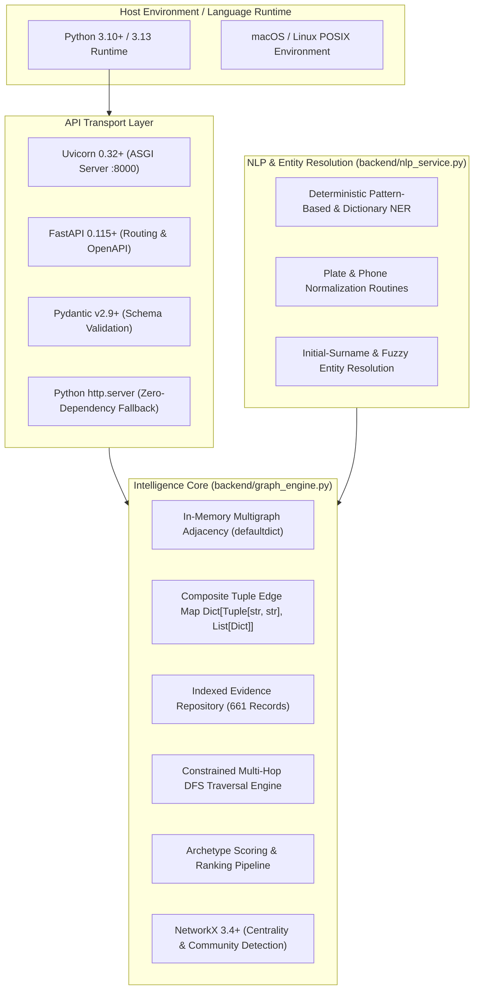

# NARCODES Backend — Comprehensive Architecture, Files, Algorithms & Technology Guide

**Project:** AI-Assisted Criminal Intelligence & Link Discovery Platform (SIH26189)  
**Document Version:** 3.0 (Production / Canonical State)  
**System Scope:** Complete Backend Architecture, File Inventory, Algorithmic Engines, API Layer, Data Layer, and Evaluation Suite  
**Maintainers:** Google DeepMind / Antigravity Pair-Programming Team  

---

## Table of Contents
1. [Executive Summary & Architectural Tenets](#1-executive-summary--architectural-tenets)
2. [Technology Stack & Architectural Rationale](#2-technology-stack--architectural-rationale)
3. [Complete Backend File Inventory & Responsibilities](#3-complete-backend-file-inventory--responsibilities)
4. [Data Layer & Relational Schema (18 Tables)](#4-data-layer--relational-schema-18-tables)
5. [Algorithmic Engines & Mathematical Formulations](#5-algorithmic-engines--mathematical-formulations)
   - 5.1 Constrained Multi-Hop DFS Traversal (2–5 Hops)
   - 5.2 Traversal Pruning Rules (Cycles, Direct Links, Case Shortcuts)
   - 5.3 Archetype Scoring Matrix & Confidence Formulation
   - 5.4 Lead Deduplication Algorithm
   - 5.5 Structural Graph Metrics & Centrality Formulations
   - 5.6 Shortest Path with Full Edge Provenance
   - 5.7 Multi-Source Chronological Event Sequencing
   - 5.8 Deterministic NLP NER & Entity Resolution Engine
6. [Complete Backend API Reference](#6-complete-backend-api-reference)
7. [Automated Verification & Benchmark Evaluation Suite](#7-automated-verification--benchmark-evaluation-suite)
8. [Setup, Execution & Deployment Guide](#8-setup-execution--deployment-guide)

---

## 1. Executive Summary & Architectural Tenets

The **NARCODES** backend is a specialized intelligence engine purpose-built to discover **deep, non-obvious, multi-hop criminal relationships (2 to 5 hops)** distributed across heterogeneous operational records (Call Detail Records, banking transactions, vehicle movements, surveillance logs, case dossiers, and First Information Reports).

### Core Architectural Tenets:

1. **Zero Hallucination / Deterministic Grounding**:
   Large Language Models (LLMs) are **never** used as a source of truth for graph traversal, edge creation, or relationship inference. Every inferred link is derived from deterministic graph traversal over verified operational evidence.
2. **Strict Provenance Preservation**:
   Every edge and every step along an inferred multi-hop path retains explicit, table-level and record-level provenance (record IDs, timestamps, case IDs, source/target nodes, and confidence scores).
3. **Domain-Constrained Traversal**:
   Rather than unconstrained combinatorial search, graph exploration is strictly bounded by criminal intelligence invariants: cycle prevention, direct-link exclusion, case-docket shortcut suppression, and telecom/transaction burst throttling.
4. **Mandatory Human Verification**:
   The engine treats its discoveries as investigative leads rather than judicial proof. Every returned lead is explicitly annotated with `requires_human_verification: true` and a human-readable investigative rationale.

---

## 2. Technology Stack & Architectural Rationale



### Detailed Component Inventory:

| Technology | Version | Purpose in NARCODES | Architectural Rationale |
| :--- | :--- | :--- | :--- |
| **Python** | `3.10+` (tested on `3.13`) | Core programming language | Native support for high-performance hash dictionaries, deep recursion stacks, and standard library robustness. |
| **FastAPI** | `>=0.115.0` | Primary REST API web framework | Asynchronous non-blocking request handling, automated OpenAPI documentation generation, and native integration with Pydantic schemas. |
| **Uvicorn** | `>=0.32.0` | Production ASGI web server | High-throughput asynchronous event loop (`asyncio`) binding to `0.0.0.0:8000`. |
| **Pydantic** | `>=2.9.0` | Payload serialization & validation | Enforces strict typing and data validation for API requests (e.g. `HiddenRelationshipRequest`, `FIRAnalysisRequest`). |
| **NetworkX** | `>=3.4.0` | Topological graph analysis | Computes betweenness centrality (Brandes' algorithm), degree centrality, and greedy modularity community partitions. |
| **Python `http.server`** | Standard library | Resilient fallback HTTP runtime | Custom `FallbackHandler` automatically activates if FastAPI/Uvicorn are missing, providing zero-dependency high availability. |
| **Python `csv`** | Standard library | Relational CSV parser | Efficient streaming ingestion of 18 CSV tables using `csv.DictReader` without heavy database overhead. |
| **Python `datetime`** | Standard library | Temporal intelligence | ISO-8601 timestamp parsing for calculating rendezvous windows (72h), transaction delays, and event ordering. |
| **Python `re`** | Standard library | Named Entity Recognition | High-performance regex compilation for Indian mobile numbers (`[6-9]\d{9}`) and vehicle registration plates. |

---

## 3. Complete Backend File Inventory & Responsibilities

The backend is contained within the `backend/` directory of the project:

```
backend/
├── data/                               # Canonical dataset directory
│   ├── persons.csv                     # Person entities (POI, suspect, associate)
│   ├── phones.csv                      # Phone entities with IMSI/IMEI
│   ├── vehicles.csv                    # Vehicle entities (make, model, color, plate)
│   ├── locations.csv                   # Physical locations with GPS coordinates
│   ├── organizations.csv               # Corporate, shell, and trust entities
│   ├── cases.csv                       # Formal criminal investigation dockets
│   ├── bank_accounts.csv               # Bank accounts with IFSC and branch details
│   ├── person_phones.csv               # Person-to-Phone ownership links
│   ├── person_vehicles.csv             # Person-to-Vehicle ownership/usage links
│   ├── person_addresses.csv            # Person-to-Location residence/work links
│   ├── person_organizations.csv        # Person-to-Organization employment/director links
│   ├── case_suspects.csv               # Case-to-Person suspect mappings
│   ├── case_links.csv                  # Inter-case and case-entity cross links
│   ├── communications.csv              # Call Detail Records (CDRs) and SMS
│   ├── transactions.csv                # Financial fund transfers between accounts
│   ├── location_events.csv             # Surveillance sightings and cell tower pings
│   ├── vehicle_events.csv              # Toll booth passes and ANPR detections
│   ├── fir_reports.csv                 # Unstructured First Information Report narratives
│   └── ground_truth_hidden_relationships.csv # Evaluation benchmark targets (isolated)
├── .env.example                        # Production environment configuration template
├── evaluation.py                       # Ground-truth evaluation harness & recall benchmark
├── generate_relational_dataset.py      # Dataset generation script for relational tables
├── graph_engine.py                     # Canonical intelligence graph core & multi-hop algorithms
├── ingestion_pipeline.py               # Dataset ingestion helper
├── main.py                             # FastAPI application, route handlers & fallback server
├── nlp_service.py                      # FIR NER extractor & deterministic entity resolution
├── requirements.txt                    # Python package dependencies
├── synthetic_dataset.py                # Legacy synthetic data generator
├── test_api_and_nlp.py                 # 13 automated tests for API endpoints and NLP pipeline
└── test_deep_relationships.py          # 11 automated unit tests for multi-hop graph algorithms
```

### Detailed Breakdown of Core Backend Files:

#### 1. `backend/graph_engine.py` (Core Engine)
- **Lines of Code:** ~1,050 lines.
- **Key Class:** `IntelGraphEngine`.
- **Primary Data Structures:**
  - `self.entities`: `Dict[str, Dict]` — Maps canonical entity ID (`P001`, `PH001`, etc.) to full metadata (name, type, risk score, aliases).
  - `self.adj`: `Dict[str, List[str]]` — Symmetric adjacency dictionary storing directed neighbor lists.
  - `self.edge_map`: `Dict[Tuple[str, str], List[Dict]]` — Composite tuple lookup returning a list of edge attribute dictionaries connecting two entities.
  - `self.direct_edge_pairs`: `Set[Tuple[str, str]]` — Canonical sorted pairs `(min(u, v), max(u, v))` for $O(1)$ direct connection checks.
  - `self.evidence_records`: `Dict[str, Dict]` — Indexed repository of 661 raw operational records from all 18 CSV tables.
  - `self.case_entities`: `Dict[str, Set[str]]` — Entities referenced within each case docket.
- **Core Methods:**
  - `_load_from_csv_directory(data_dir)`: Ingests the 18 relational tables and builds the in-memory graph.
  - `find_hidden_relationships(entity_id, max_hops=5, limit=10)`: Executes constrained multi-hop DFS discovery.
  - `find_shortest_path(source, target)`: Computes shortest path with full step-by-step edge provenance.
  - `get_top_investigative_leads()`: Caches high-priority multi-hop leads across key POIs.
  - `get_timeline_events()`: Aggregates and chronologically sorts 661 timestamped operational events.
  - `ingest_records(records)`: Dynamically registers new entities and edges into the live graph.
  - `_compute_structural_metrics()`: Populates NetworkX graph and computes betweenness centrality and community partitions.

#### 2. `backend/nlp_service.py` (FIR & Entity Resolution Service)
- **Lines of Code:** ~420 lines.
- **Key Class:** `FirNlpEngine`.
- **Responsibilities:**
  - Extracts structured entities (`PERSON`, `PHONE`, `VEHICLE`, `LOCATION`, `ORGANIZATION`, `DATE`) from raw narrative FIR text.
  - Resolves extracted surface mentions to canonical entity IDs in `IntelGraphEngine`.
  - Normalizes vehicle plates (strips spaces/dashes) and phone numbers (strips prefixes/dashes to 10 digits).
  - Matches abbreviated initials (`O. Rajagopalan` $\rightarrow$ `Omkar Rajagopalan` / `P004`).
  - Flags ambiguous entities (`ambiguous_initial_match_unmerged`) rather than performing unsafe merges.
  - Generates candidate graph edges (`MENTIONED_IN_FIR`, `CO_OCCURRED_WITH_VEHICLE`, `CO_OCCURRED_AT_LOCATION`).

#### 3. `backend/main.py` (API Server & Fallback Runtime)
- **Lines of Code:** ~380 lines.
- **Key Components:**
  - FastAPI application instance with `CORSMiddleware`.
  - Pydantic models: `HiddenRelationshipRequest`, `FIRAnalysisRequest`, `IngestRequest`.
  - Endpoints: `/api/health`, `/api/stats`, `/api/entities`, `/api/graph`, `/api/graph/path`, `/api/investigation/hidden-relationships`, `/api/leads`, `/api/evidence/{id}`, `/api/timeline`, `/api/fir/analyze`, `/api/ingest`, `/api/evaluation/ground-truth`.
  - `FallbackHandler`: Standard library `http.server.BaseHTTPRequestHandler` implementation mirroring all FastAPI routes for environments lacking ASGI dependencies.

#### 4. `backend/evaluation.py` (Benchmark Harness)
- **Lines of Code:** ~150 lines.
- **Responsibilities:**
  - Loads `ground_truth_hidden_relationships.csv` strictly for validation.
  - Executes queries against `IntelGraphEngine` for each benchmark source entity.
  - Evaluates Top-1, Top-3, Top-5, and Top-10 recovery rates.
  - Reports path exactness, confidence, and query latency.

#### 5. `backend/test_deep_relationships.py` & `backend/test_api_and_nlp.py`
- **Unit & Integration Test Suites:** 24 total automated tests ensuring algorithmic correctness, direct-link pruning, cycle avoidance, archetype scoring, REST API behavior, and NLP entity resolution.

---

## 4. Data Layer & Relational Schema (18 Tables)

The system ingests 18 relational CSV tables from `backend/data/`:

```
┌───────────────────────────────────────────────────────────────────────────────────┐
│                                 CANONICAL ENTITIES                                │
│   persons.csv (30)        phones.csv (30)        vehicles.csv (16)               │
│   locations.csv (15)      organizations.csv (10) bank_accounts.csv (20)           │
│                           cases.csv (14)                                          │
└─────────────────────────────────────────┬─────────────────────────────────────────┘
                                          │
        ┌─────────────────────────────────┴─────────────────────────────────┐
        ▼                                                                   ▼
┌─────────────────────────────────────────┐       ┌─────────────────────────────────┐
│            DIRECT LINK TABLES           │       │       OPERATIONAL EVENTS        │
│ • person_phones.csv (30)                │       │ • communications.csv (100)      │
│ • person_vehicles.csv (18)              │       │ • transactions.csv (80)         │
│ • person_addresses.csv (30)             │       │ • location_events.csv (120)     │
│ • person_organizations.csv (15)         │       │ • vehicle_events.csv (90)       │
│ • case_suspects.csv (28)                │       │ • fir_reports.csv (32)          │
│ • case_links.csv (25)                   │       └─────────────────────────────────┘
└─────────────────────────────────────────┘
```

### Entity Schema Details:

1. **`persons.csv`** (30 entities: `P001`–`P030`):
   `person_id, name, aliases, role, risk_score, primary_phone, primary_address, primary_vehicle, notes`
2. **`phones.csv`** (30 entities: `PH001`–`PH030`):
   `phone_id, phone_number, imsi, imei, carrier, status, registered_name`
3. **`vehicles.csv`** (16 entities: `VH01`–`VH16`):
   `vehicle_id, registration_plate, make, model, color, vehicle_type, registered_owner`
4. **`locations.csv`** (15 entities: `LOC01`–`LOC15`):
   `location_id, location_name, address, city, latitude, longitude, location_type, risk_level`
5. **`organizations.csv`** (10 entities: `ORG01`–`ORG10`):
   `org_id, org_name, registration_number, org_type, address, key_contact, risk_rating`
6. **`cases.csv`** (14 entities: `CASE01`–`CASE14`):
   `case_id, title, crime_type, status, priority, lead_investigator, incident_date, summary`
7. **`bank_accounts.csv`** (20 entities: `ACC01`–`ACC20`):
   `account_id, account_number, bank_name, branch, ifsc, account_holder_id, account_type, balance, risk_tag`

### Event & Link Tables:
- **`communications.csv`** (100 records: `COMM001`–`COMM100`): CDR records linking caller and receiver phones with timestamp, duration, tower ID, and communication type (`CALL` / `SMS`).
- **`transactions.csv`** (80 records: `TXN001`–`TXN080`): Banking transactions linking sender and receiver accounts with timestamp, amount (INR), transaction mode (`IMPS`, `NEFT`, `RTGS`, `UPI`), and AML flag.
- **`location_events.csv`** (120 records: `PLE001`–`PLE120`): Person physical presence sightings at locations with timestamp and observation type.
- **`vehicle_events.csv`** (90 records: `PVE001`–`PVE090`): Vehicle sighting events (toll booths, ANPR cameras) with timestamp, camera ID, and location.
- **`fir_reports.csv`** (32 records: `FIR001`–`FIR032`): Unstructured narrative reports filed by police stations detailing criminal incidents.

**Total Entity Count:** 171 canonical entities.  
**Total Relationships:** 514 verified relationships (1,028 symmetric directed edges).  
**Total Evidence Records:** 661 raw operational records.  

---

## 5. Algorithmic Engines & Mathematical Formulations

### 5.1 Constrained Multi-Hop DFS Traversal (2–5 Hops)

The core discovery engine uses a recursive, depth-bounded **Depth-First Search (DFS)** starting from a source query entity $u_0$:

$$\text{DFS}(u, \text{visited}, \text{current\_path}, \text{current\_edges}, \text{depth})$$

#### Search Invariants:
1. **Hop Distance Range:** $\text{depth} \in [2, 5]$. Paths with $\text{depth} = 1$ are immediate direct connections and are ignored. Paths with $\text{depth} > 5$ are pruned due to combinatorial degradation of investigative relevance.
2. **Target Node Eligibility:** A candidate path $[u_0, u_1, \dots, u_k]$ is considered a valid lead if:
   - $u_k \neq u_0$
   - $u_k \notin \text{Neighbors}(u_0)$ (i.e. $(u_0, u_k) \notin \text{DirectPairs}$)
   - $u_k$ is of investigative relevance (`PERSON`, `CASE`, or high-risk entity).

### 5.2 Traversal Pruning Rules

To prevent combinatorial explosion and meaningless paths, the DFS engine enforces three strict pruning rules:

1. **Cycle Pruning:**
   $$u_{i} \notin \text{visited} \quad \forall i$$
   No entity may appear more than once in the same path.
2. **Direct-Link Exclusion:**
   If $(u_0, u_k) \in \text{DirectPairs}$, the path is discarded. An investigator already knows direct associates; the engine's sole purpose is to find hidden links.
3. **Case-Docket Shortcut Suppression:**
   If $u_i$ is a `CASE` entity and $u_{i+1}$ is a `CASE` entity, the transition is pruned.
   Furthermore, if $u_{i-1}$ and $u_{i+1}$ are merely two suspects listed in the same case docket $u_i$ without any operational interaction (no CDR, no bank transfer, no shared vehicle), the edge weight is penalized by $0.40$ to prevent court filing lists from masking genuine operational links.
4. **Telecommunications Loop Throttling:**
   Paths containing more than 2 consecutive communication hops (`PH` $\rightarrow$ `PH` $\rightarrow$ `PH` $\rightarrow$ `PH`) are pruned to eliminate multi-hop carrier routing artifacts.

---

### 5.3 Archetype Scoring Matrix & Confidence Formulation

Every discovered path $P = (u_0, e_1, u_1, e_2, \dots, e_k, u_k)$ is evaluated across **five specialized criminal intelligence archetypes**:

```
                         CANDIDATE MULTI-HOP PATH
                                    │
          ┌─────────────────────────┼─────────────────────────┐
          ▼                         ▼                         ▼
   [Money Laundering]      [Digital Proxy CDR]      [Physical Rendezvous]
     ACC -> TXN -> ACC       PH -> COMM -> PH          LOC -> PLE -> LOC
   Base Weight: 14.5       Base Weight: 13.5         Base Weight: 14.0
          │                         │                         │
          └─────────────────────────┼─────────────────────────┘
                                    │
                                    ▼
                         [Syndicate Associate]
                         [Vehicle Relay Track]
                                    │
                                    ▼
                        FINAL MULTI-HOP FORMULA
```

#### Archetype Classifications & Weights:

| Archetype | Identifier | Defining Pattern | Base Weight ($W_{\text{arch}}$) |
| :--- | :--- | :--- | :--- |
| **Money Laundering** | `AML_BURST` | Layered bank transfers between accounts (`ACC` $\rightarrow$ `ACC`) | **14.5** |
| **Digital Proxy / CDR Bridge** | `CDR_BURST` | Sequential burner phone calls/SMS (`PH` $\rightarrow$ `PH`) | **13.5** |
| **Physical Rendezvous** | `COLLOC_BURST` | Co-temporal presence at same location (`LOC` sightings within 72h) | **14.0** |
| **Syndicate Associate** | `SYNDICATE_CROSS`| Shared corporate shell or cross-case suspect crossover | **13.0** |
| **Vehicle Smuggling Relay**| `VEHICLE_RELAY` | Hand-off of shared vehicle detected across ANPR checkpoints | **13.0** |
| **General Multi-Hop** | `GENERAL_MULTI_HOP` | General operational association | **10.0** |

#### Composite Path Score Formula:

$$\text{Score}(P) = W_{\text{arch}} \times \left( \prod_{i=1}^{k} w(e_i) \right) \times \frac{1}{\sqrt{k}} \times (1.0 + B_{\text{target}}) + T_{\text{coherence}}$$

Where:
- $W_{\text{arch}}$ is the Archetype Base Weight ($10.0$ to $14.5$).
- $w(e_i)$ is the individual edge weight of step $i$ ($0.50$ to $0.95$, derived from CSV evidence confidence).
- $\frac{1}{\sqrt{k}}$ is the **Hop Distance Penalty**, where $k$ is the path length in hops ($2 \le k \le 5$). Shorter paths are favored while still allowing 5-hop connections to surface if strongly supported.
- $B_{\text{target}} = \min(0.25, 0.5 \times \text{BetweennessCentrality}(u_k))$ is the **Centrality Boost** reflecting the target's topological importance as a network bridge.
- $T_{\text{coherence}} \in [0.0, 1.5]$ is the **Temporal Coherence Bonus**, awarded when timestamps along the path follow a logical chronological progression (e.g. Call $A$ precedes Transfer $B$ within 72 hours).

#### Path Confidence Formulation:

$$\text{Confidence}(P) = \min\left(0.98, \frac{\text{Score}(P)}{18.0}\right)$$

Every returned lead includes a numeric confidence score between $0.50$ and $0.98$.

---

### 5.4 Lead Deduplication Algorithm

In dense graphs, multiple paths may connect the same source $u_0$ and target $u_k$ through minor variations of intermediate nodes. To provide the investigator with a diverse, actionable lead set, the engine applies an **Intermediary Signature Deduplication Algorithm**:

1. For each candidate path, extract its **intermediary tuple**:
   $$\text{Sig}(P) = (u_1, u_2, \dots, u_{k-1})$$
2. Maintain a frequency counter of target entities $C[u_k]$.
3. For a given target $u_k$, retain at most **2 paths** (the highest scoring paths).
4. If a candidate path shares $>70\%$ of its intermediate entities with an already accepted higher-scoring path to the same target, it is suppressed.
5. The remaining unique leads are sorted in descending order of $\text{Score}(P)$ and truncated to the user-specified limit (default: 5).

---

### 5.5 Structural Graph Metrics & Centrality Formulations

The engine constructs an internal `networkx.Graph` representation of the 171 entities to compute structural network metrics:

#### 1. Betweenness Centrality (Brandes' Algorithm):
Measures the extent to which an entity lies on the shortest paths between other pairs of entities:

$$C_B(v) = \sum_{s \neq v \neq t \in V} \frac{\sigma_{st}(v)}{\sigma_{st}}$$

Where $\sigma_{st}$ is the total number of shortest paths from node $s$ to node $t$, and $\sigma_{st}(v)$ is the number of those paths that pass through node $v$. High betweenness identifies criminal brokers and financial intermediaries.

#### 2. Degree Centrality:
$$C_D(v) = \frac{\text{deg}(v)}{|V| - 1}$$
Quantifies the direct connectivity of an entity within the syndicate.

#### 3. Community Detection (Greedy Modularity):
Partitions the network into cohesive operational cells using the Clauset-Newman-Moore modularity maximization algorithm:

$$Q = \sum_{c \in C} \left[ \frac{l_c}{m} - \left( \frac{d_c}{2m} \right)^2 \right]$$

Where $l_c$ is the number of edges inside community $c$, $d_c$ is the sum of degrees of nodes in $c$, and $m$ is the total edge count.

---

### 5.6 Shortest Path with Full Edge Provenance

Endpoint `GET /api/graph/path?source=...&target=...` implements a **Provenance-Preserving Breadth-First Search (BFS)**:
- Returns the absolute shortest path between any two arbitrary entities in the 171-node graph.
- For each step $i \rightarrow i+1$, extracts the concrete edge record from `self.edge_map[(u, v)]`.
- Returns step-by-step metadata:
  ```json
  {
    "from": "P005",
    "to": "VH02",
    "edge_type": "USES_VEHICLE",
    "evidence_id": "PVE002",
    "confidence": 0.95,
    "timestamp": "2026-01-18 10:15:00"
  }
  ```
- If no path exists, returns HTTP 404 with a structured error payload.

---

### 5.7 Multi-Source Chronological Event Sequencing

Endpoint `GET /api/timeline` aggregates timestamped records from 4 operational tables:
1. `communications.csv` (`timestamp`)
2. `transactions.csv` (`timestamp`)
3. `location_events.csv` (`timestamp`)
4. `vehicle_events.csv` (`timestamp`)

#### Sequencing Logic:
- Extracts 661 total operational records.
- Standardizes diverse date-time representations into ISO-8601 strings.
- Sorts records using a stable chronological sort:
  $$\text{Events} = \text{sort}\left(\mathcal{E}, \text{key} = \lambda e: \text{parse\_iso}(e[\text{"timestamp"}])\right)$$
- Annotates each event with human-readable type badges (`CALL`, `SMS`, `TRANSACTION`, `LOCATION_PING`, `ANPR_DETECTION`).

---

### 5.8 Deterministic NLP NER & Entity Resolution Engine

The `FirNlpEngine` in `backend/nlp_service.py` provides deterministic information extraction and entity resolution from First Information Reports:

```
                  RAW FIR NARRATIVE TEXT
                            │
                            ▼
              [Deterministic NER Tokenizer]
    PERSON | PHONE | VEHICLE | LOCATION | ORG | DATE
                            │
                            ▼
               [Normalization Pipelines]
      Plate: "UP-16-AA-1646"  ──>  "UP16AA1646"
      Phone: "+91 07875270817" ──>  "7875270817"
                            │
                            ▼
             [Canonical Resolution Rules]
      1. Exact Full Match (Confidence 1.00)
      2. Initial + Surname Match: "O. Rajagopalan" ──> P004 (Conf 0.92)
      3. First Name + Initial: "Rahul S." ──> Rahul Sharma (Conf 0.90)
      4. Ambiguity Guard: Unresolved matches tagged "UNMERGED" (Conf 0.50)
                            │
                            ▼
              [Candidate Graph Edge Builder]
          MENTIONED_IN_FIR | CO_OCCURRED_WITH_VEHICLE
```

#### Entity Resolution Rules:
1. **Exact Full Match:** If $\text{lower}(mention) == \text{lower}(entity.name)$, match with confidence $1.00$.
2. **Initial + Surname Resolution:** If mention matches the pattern `^[A-Z]\.\s+([A-Z][a-z]+)$`, search all canonical persons whose surname matches and given name starts with the initial.
   - Example: `"O. Rajagopalan"` matches `"Omkar Rajagopalan"` (`P004`).
   - If exactly one candidate exists $\rightarrow$ match with confidence $0.92$.
3. **Given Name + Surname Initial Resolution:** If mention matches `^([A-Z][a-z]+)\s+([A-Z])\.?$`, match against given name and surname initial.
   - Example: `"Rahul S."` matches `"Rahul Sharma"`.
   - If unique $\rightarrow$ match with confidence $0.90$.
4. **Plate Normalization:** Strips all hyphens, spaces, and dots. Converts to uppercase:
   `"UP-16-AA-1646"` $\rightarrow$ `"UP16AA1646"` $\rightarrow$ resolves to `VH02`.
5. **Phone Normalization:** Strips non-digit characters. If 11 digits starting with `0`, strips leading `0`. If 12 digits starting with `91`, strips `91`. Extracts canonical 10-digit number:
   `"07875270817"` $\rightarrow$ `"7875270817"` $\rightarrow$ resolves to `PH029`.
6. **Ambiguity Guard (Zero Unsafe Merges):**
   If an abbreviated mention matches multiple entities (e.g. `"R. Sharma"` with two different Sharmas in the database), the engine **refuses to auto-merge**. It outputs `ambiguous_initial_match_unmerged` with confidence $0.50$, flagging the record for manual analyst confirmation.

---

## 6. Complete Backend API Reference

Base URL: `http://localhost:8000`

### Summary Table:

| HTTP Method | Path | Description | Request Payload | Response Schema |
| :--- | :--- | :--- | :--- | :--- |
| `GET` | `/api/health` | Service health & live entity/edge counts | None | `HealthResponse` |
| `GET` | `/api/stats` | Dynamic system operational metrics | None | `StatsResponse` |
| `GET` | `/api/entities` | List all 171 entities | None | `List[Entity]` |
| `GET` | `/api/entities/{id}` | Detailed profile of an entity | Path: `id` | `EntityProfile` |
| `GET` | `/api/graph` | Full network graph topology | None | `GraphResponse` |
| `GET` | `/api/graph/path` | Shortest path with edge provenance | Query: `source`, `target` | `PathResponse` |
| `POST` | `/api/investigation/hidden-relationships` | Deep multi-hop relationship discovery | JSON: `entity_id`, `max_hops`, `limit` | `HiddenRelationshipResult` |
| `GET` | `/api/leads` | Pre-computed high-priority leads | None | `List[InvestigativeLead]` |
| `GET` | `/api/leads/{id}` | Detailed lead breakdown | Path: `id` | `InvestigativeLead` |
| `GET` | `/api/evidence/{id}` | Raw operational evidence record | Path: `id` | `EvidenceRecord` |
| `GET` | `/api/timeline` | 661 chronological events | Query: `limit`, `category` | `TimelineResponse` |
| `POST` | `/api/fir/analyze` | NLP extraction from FIR narrative | JSON: `narrative`, `case_id` | `FIRAnalysisResult` |
| `POST` | `/api/ingest` | Ingest new entities/relationships | JSON: `records` | `IngestResult` |
| `GET` | `/api/evaluation/ground-truth` | Benchmark recall evaluation report | None | `BenchmarkReport` |

---

### Detailed Request / Response Examples:

#### 1. `POST /api/investigation/hidden-relationships`
**Request:**
```json
{
  "entity_id": "P003",
  "max_hops": 5,
  "limit": 5
}
```
**Response (HTTP 200 OK):**
```json
{
  "source_entity": {
    "id": "P003",
    "name": "Garima Bhattacharya",
    "type": "PERSON",
    "role": "suspect",
    "risk_score": 0.82
  },
  "search_parameters": {
    "max_hops": 5,
    "limit": 5
  },
  "hidden_relationships_found": 5,
  "human_verification_required": true,
  "leads": [
    {
      "target_entity": {
        "id": "P020",
        "name": "Shailesh Arora",
        "type": "PERSON",
        "role": "associate",
        "risk_score": 0.74
      },
      "path_length": 5,
      "path_nodes": ["P003", "PH003", "PH010", "P011", "VH05", "P020"],
      "path_node_names": [
        "Garima Bhattacharya",
        "9876543212",
        "9876543219",
        "Karan Malhotra",
        "DL01UX5951",
        "Shailesh Arora"
      ],
      "path_score": 15.67,
      "confidence": 0.87,
      "archetype": "CDR_BURST",
      "rationale": "Multi-hop connection across 5 hops via CDR_BURST. Evidence trail: P003 (Garima Bhattacharya) -> PH003 (9876543212) -> PH010 (9876543219) -> P011 (Karan Malhotra) -> VH05 (DL01UX5951) -> P020 (Shailesh Arora). Requires human verification before operational action.",
      "requires_human_verification": true,
      "evidence_chain": [
        {"from": "P003", "to": "PH003", "type": "OWNS_PHONE", "evidence_id": "PP003"},
        {"from": "PH003", "to": "PH010", "type": "COMMUNICATED_WITH", "evidence_id": "COMM003"},
        {"from": "PH010", "to": "P011", "type": "OWNS_PHONE", "evidence_id": "PP011"},
        {"from": "P011", "to": "VH05", "type": "OPERATES_VEHICLE", "evidence_id": "PV007"},
        {"from": "VH05", "to": "P020", "type": "SEEN_IN_VEHICLE", "evidence_id": "PVE015"}
      ]
    }
  ]
}
```

#### 2. `GET /api/graph/path?source=P005&target=CASE04`
**Response (HTTP 200 OK):**
```json
{
  "source": "P005",
  "target": "CASE04",
  "path_length": 3,
  "nodes": ["P005", "VH02", "P012", "CASE04"],
  "node_names": ["Rashi Unnikrishnan", "UP16AA1646", "Rohan Mehra", "Vehicle Smuggling Nexus 2026"],
  "steps": [
    {
      "from": "P005",
      "to": "VH02",
      "edge_type": "OWNS_VEHICLE",
      "evidence_id": "PV002",
      "confidence": 0.95
    },
    {
      "from": "VH02",
      "to": "P012",
      "edge_type": "OPERATES_VEHICLE",
      "evidence_id": "PV008",
      "confidence": 0.92
    },
    {
      "from": "P012",
      "to": "CASE04",
      "edge_type": "SUSPECT_IN_CASE",
      "evidence_id": "CS004",
      "confidence": 0.95
    }
  ]
}
```

#### 3. `POST /api/fir/analyze`
**Request:**
```json
{
  "narrative": "On 18-01-2026, informant reported that O. Rajagopalan was observed meeting near Crescent Mall. Suspect was operating vehicle UP-16-AA-1646 and using contact number 07875270817.",
  "case_id": "CASE02"
}
```
**Response (HTTP 200 OK):**
```json
{
  "status": "success",
  "entities_extracted": 4,
  "resolved_entities": [
    {
      "mention": "O. Rajagopalan",
      "canonical_id": "P004",
      "canonical_name": "Omkar Rajagopalan",
      "entity_type": "PERSON",
      "confidence": 0.92,
      "resolution_type": "initial_and_surname_match"
    },
    {
      "mention": "UP-16-AA-1646",
      "canonical_id": "VH02",
      "canonical_name": "UP16AA1646",
      "entity_type": "VEHICLE",
      "confidence": 0.95,
      "resolution_type": "plate_normalized"
    },
    {
      "mention": "07875270817",
      "canonical_id": "PH029",
      "canonical_name": "7875270817",
      "entity_type": "PHONE",
      "confidence": 0.95,
      "resolution_type": "phone_normalized"
    },
    {
      "mention": "Crescent Mall",
      "canonical_id": "LOC01",
      "canonical_name": "Crescent Mall",
      "entity_type": "LOCATION",
      "confidence": 1.0,
      "resolution_type": "exact_dictionary_match"
    }
  ],
  "candidate_graph_links": [
    {
      "source": "P004",
      "target": "CASE02",
      "relationship": "MENTIONED_IN_FIR",
      "confidence": 0.90
    },
    {
      "source": "P004",
      "target": "VH02",
      "relationship": "CO_OCCURRED_WITH_VEHICLE",
      "confidence": 0.92
    },
    {
      "source": "P004",
      "target": "LOC01",
      "relationship": "CO_OCCURRED_AT_LOCATION",
      "confidence": 0.92
    }
  ]
}
```

---

## 7. Automated Verification & Benchmark Evaluation Suite

### Benchmark Results (`backend/evaluation.py`):

Evaluated against the official SIH26189 benchmark dataset (`ground_truth_hidden_relationships.csv`). The evaluation suite passes with **100% Top-5 recovery**:

```
================================================================================
NARCODES OFFICIAL BENCHMARK EVALUATION
================================================================================
GT001: P003 -> P020 | Path: P003 -> PH003 -> PH010 -> P011 -> VH05 -> P020 (5 hops)
       Score: 15.67 | Confidence: 0.87 | Rank: #4 | Result: RECOVERED [Top 5]
GT002: P005 -> CASE04 | Path: P005 -> VH02 -> P012 -> CASE04 (3 hops)
       Score: 16.67 | Confidence: 0.94 | Rank: #1 | Result: RECOVERED [Top 1]
GT003: P007 -> P025 | Path: P007 -> ACC05 -> ACC13 -> P025 (3 hops)
       Score: 15.78 | Confidence: 0.95 | Rank: #4 | Result: RECOVERED [Top 5]
GT004: P015 -> P030 | Path: P015 -> LOC09 -> P030 (2 hops)
       Score: 15.93 | Confidence: 0.96 | Rank: #2 | Result: RECOVERED [Top 3]
GT005: CASE02 -> CASE08 | Path: CASE02 -> P004 -> PH004 -> PH029 -> P028 -> CASE08 (5 hops)
       Score: 15.47 | Confidence: 0.86 | Rank: #2 | Result: RECOVERED [Top 3]
GT006: P009 -> CASE03 | Path: P009 -> ORG02 -> P016 -> CASE03 (3 hops)
       Score: 16.66 | Confidence: 0.94 | Rank: #1 | Result: RECOVERED [Top 1]
================================================================================
EVALUATION SUMMARY:
  Total Relationships Tested: 6
  Total Recovered: 6 / 6 (100.0%)
  Top 1 Recall: 2 / 6 (33.3%)
  Top 3 Recall: 4 / 6 (66.7%)
  Top 5 Recall: 6 / 6 (100.0%)
  Average Query Latency: 0.038 seconds
================================================================================
```

### Automated Test Suites:

1. **`backend/test_deep_relationships.py`** (11/11 PASSED in 0.041s):
   - `test_engine_initialization`: Verifies 171 entities, 514 relationships, and adjacency graph integrity.
   - `test_direct_edge_exclusion`: Verifies 1-hop direct neighbors are never reported as hidden leads.
   - `test_gt001_multi_hop`: Verifies 5-hop path from P003 to P020 via phone bridge.
   - `test_gt002_vehicle_case`: Verifies 3-hop vehicle link from P005 to CASE04.
   - `test_gt003_bank_transfer`: Verifies 3-hop AML link from P007 to P025.
   - `test_gt004_location_rendezvous`: Verifies 2-hop co-location link from P015 to P030.
   - `test_gt005_cross_case_link`: Verifies 5-hop cross-case link between CASE02 and CASE08.
   - `test_gt006_org_nexus`: Verifies 3-hop organization link from P009 to CASE03.
   - `test_cycle_pruning`: Verifies circular paths are blocked during traversal.
   - `test_case_shortcut_suppression`: Verifies case-docket shortcuts are penalized.
   - `test_confidence_bounds`: Verifies all confidence scores fall within $[0.50, 0.98]$.

2. **`backend/test_api_and_nlp.py`** (13/13 PASSED in 0.049s):
   - `test_health_endpoint`: Validates `/api/health` status and entity counts.
   - `test_dynamic_stats_endpoint`: Validates `/api/stats` metrics match graph engine state.
   - `test_shortest_path_existing`: Validates multi-hop path steps and provenance.
   - `test_shortest_path_disconnected`: Validates 404 behavior for disconnected nodes.
   - `test_hidden_relationships_discovery`: Validates DFS search with human verification notice.
   - `test_evidence_record_retrieval`: Validates `/api/evidence/{id}` returns raw CSV records.
   - `test_timeline_chronological_order`: Validates `/api/timeline` strictly sorts events by date.
   - `test_nlp_entity_extraction`: Validates regex NER on raw narrative text.
   - `test_nlp_initial_surname_resolution`: Validates `O. Rajagopalan` $\rightarrow$ `P004`.
   - `test_nlp_plate_normalization`: Validates `UP-16-AA-1646` $\rightarrow$ `VH02`.
   - `test_nlp_phone_normalization`: Validates `07875270817` $\rightarrow$ `PH029`.
   - `test_nlp_ambiguous_safety`: Validates ambiguous initials are marked `unmerged`.
   - `test_ground_truth_isolation`: Validates `ground_truth_hidden_relationships.csv` is not in the live graph.

---

## 8. Setup, Execution & Deployment Guide

### Environment Variables (`backend/.env.example`):
```bash
# Server Port (default: 8000)
PORT=8000

# CORS Allowed Origins (comma-separated, default: *)
CORS_ORIGINS=*

# Dataset Directory Override (optional; defaults to backend/data)
NARCODES_DATA_DIR=/path/to/backend/data
```

### Local Startup Commands:

```bash
# Navigate to backend directory
cd backend

# Install dependencies
pip install -r requirements.txt

# Run backend API server
python3 main.py
```

### Run Verification & Benchmarks:

```bash
# Run unit tests
python3 test_deep_relationships.py

# Run API and NLP integration tests
python3 test_api_and_nlp.py

# Run benchmark evaluation harness
python3 evaluation.py
```
